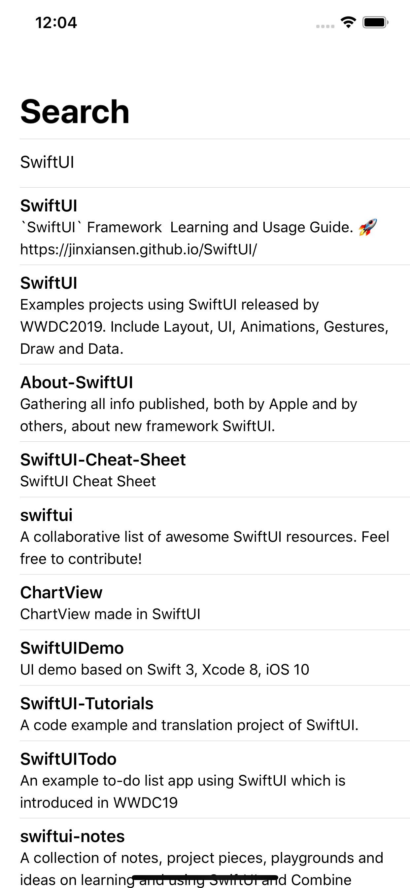

## Redux trong SwiftUI

Mình có inbox hỏi tác giả liệu có framework nào không, thì được trả lời là chỉ cần 1 ít code là có thể tạo redux trong SwiftUI rồi. 

Đây là ví dụ về tìm kiếm sử dụng API của github, code bằng SwiftUI. Một mẫu đơn giản để dựng các project phức tạp. 

### 

Sử dụng Redux cho SwiftUI

