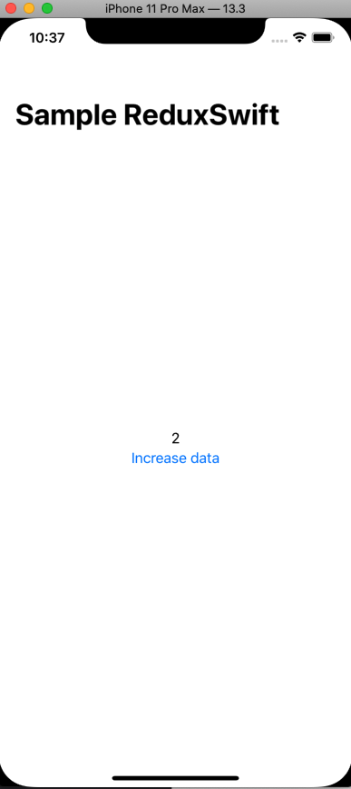

## Redux trong SwiftUI

Một kiến trúc clear để tạo các dự án theo mô hình Redux trong SwiftUI.

Bạn có thể phát triển dự án mà không lo sự phức tạp khi thêm các tính năng mới cho app.

Đây là ví dụ về Redux gồm các bước sau:

1. gọi 1 sự kiện bấm nút, sau đó dispatch sự kiện(action) vào store

2. Action tiến hành tăng biến đếm lên 1 và dispatch bằng hàm SetSampleAction. Ở đây các bạn có thể thêm các action khác như gọi API và đợi response trả về sau đó dispatch action.

3. Khi action được set, thì đồng thời sampleStateReducer sẽ xử lý action này tuỳ kịch bản bạn muốn. Ví dụ ở đây mình sẽ tăng giá trị của number trong state lên bằng giá trị mới. 

4. Ở màn hình ContentView, khi state được thay đổi, thì giá trị của Label sẽ thay đổi do nó lắng nghe theo props.number

### 

Sử dụng Redux cho SwiftUI

