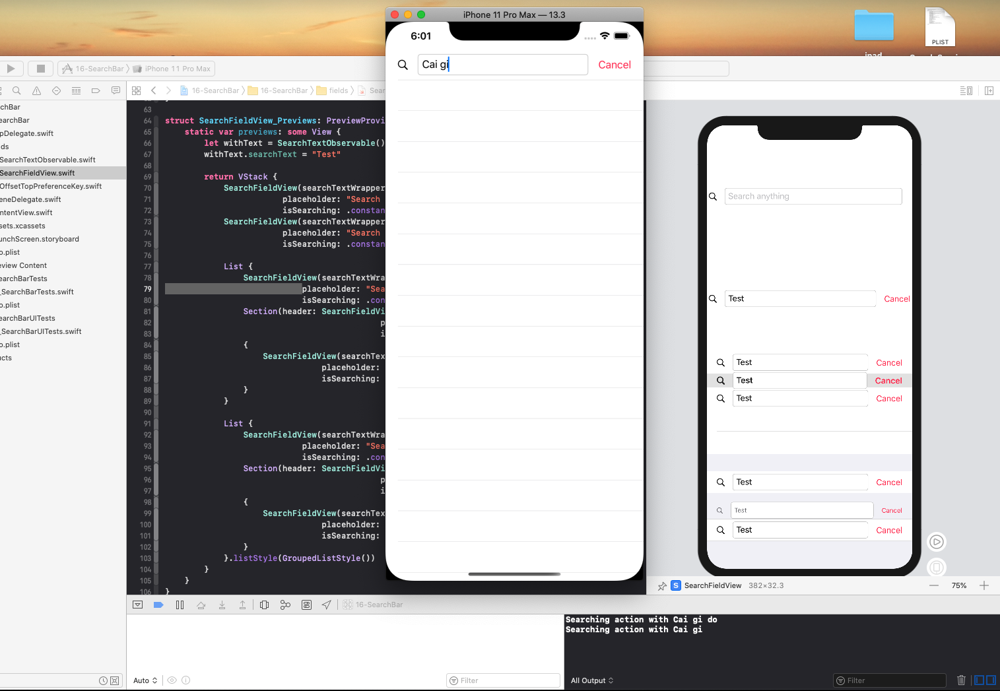

## Searchbar trong SwiftUI

Một mẫu search đơn giản trong swiftui.

Tách UI search và listener để xử lý action. Tự động search sau khoảng thời gian 0.5s  ở hàm loadPage của lớp SearchPageListener
### 

Sử dụng Redux cho SwiftUI

