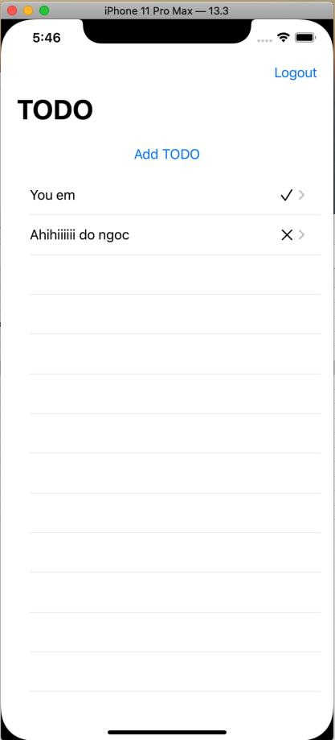

# Todo 

## Để chạy project bạn phải:

- Vào firebase tạo 1 project với bunndle id của bạn

- Vào phần Authentication và bật authen với mail/password

- Vào phần Database, tạo database. Ở mục realtime database, chọn rules và add rule với truyền truy cập khi đăng nhập như sau:

{
  "rules": {
    "$uid": {
      ".write": "$uid === auth.uid",
      ".read": "$uid === auth.uid"
   }
 }
}

- Tải file GoogleService-Info.plist bằng cách vào mục project overview -> project setting -> Download the latest config file. 
Kéo thả vào project của bạn. 

