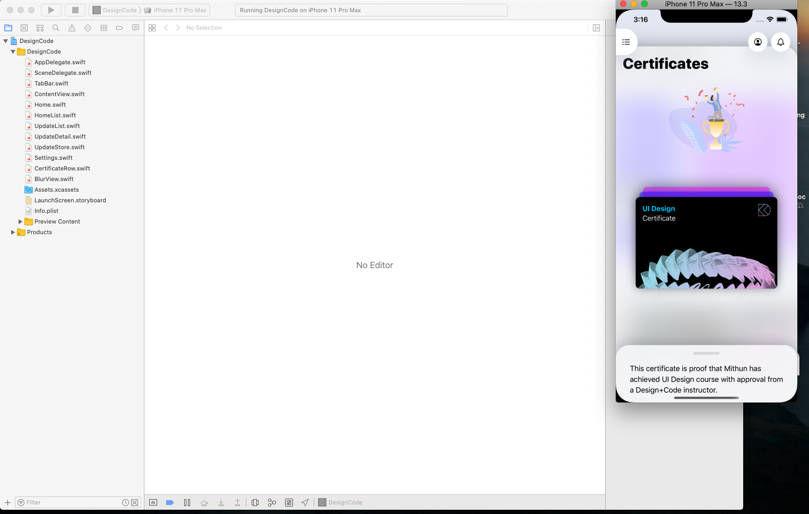

# LearningSwiftUI
swiftUI for beginning - Học SwiftUI.

## 🔷  Yêu cầu  / Requirement

&nbsp;&nbsp;&nbsp;&nbsp;&nbsp;✅ macOS 10.15+  
&nbsp;&nbsp;&nbsp;&nbsp;&nbsp;✅ Xcode 11.0+  
&nbsp;&nbsp;&nbsp;&nbsp;&nbsp;✅ Swift 5+  
&nbsp;&nbsp;&nbsp;&nbsp;&nbsp;✅ iOS 13+  

## 🔷 Cài đặt / Setup

Clone hoặc nhấn nút tải File zip về - Clone or download this repo. 

## 🔷 Kiến thức / what about learning

- [x] Tạo các component view cơ bản / Create simple basic components.
- [x] Hiểu về state trong SwiftUI  - Understanding state in swiftUI
- [x] Hiểu về binding dữ liệu trong SwiftUI   - Understanding binding in swiftUI
- [x] Làm màn hình chào mừng trong app - make onboarding screen in the app
- [x] Làm ứng dụng todolist với firebase data realtime - working firebase and swiftUI
- [x] Làm ứng dụng viết story với firebase data realtime  - write the "story " working realtime with firebase
- [x] Sử dụng MenuContext - using menu context
- [x] Tạo form đơn giản - create basic form
- [x] Sử dụng Redux trong SwiftUI - use redux in swiftui
- [x] Custom Dark mode trong SwiftUI - custom dark mode in swiftUI
- [x] Hiệu ứng effect trong SwiftUI và UIKit - effect in swiftUI
- [x] Thêm một mẫu Redux chuẩn để xây dựng các dự án lớn trong SwiftUI - Redux base app template for buidling big app
- [x] Thêm mẫu SearchUI xử lý phần search hay dùng - search template component for swiftUI
- [x] Rất nhiều source code có sẵn để tham khảo về cách thiết kế UI trong SwiftUI - and more sources for researching

## 🔷 Tác giả

[@thecodebugs](https://twitter.com/thecodebugs)

### 
